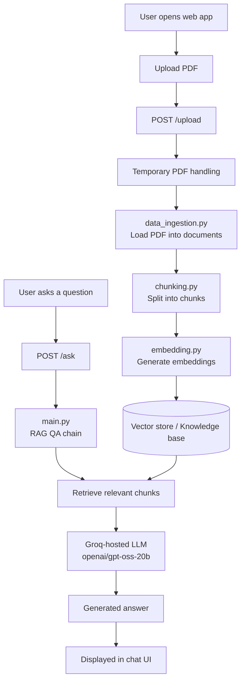

# 📄 AI Document Assistant – RAG Application

A FastAPI-based web application that lets users upload a PDF and ask questions about its content. The app uses a Retrieval-Augmented Generation (RAG) pipeline: it splits the document into chunks, creates embeddings, retrieves the most relevant passages for a question, and passes them to a Groq-hosted LLM to generate an answer grounded in the uploaded document.

---

## 📌 Table of Contents

- [Project Overview](#-project-overview)
- [Project Highlights](#-project-highlights)
- [Features](#-features)
- [Tech Stack](#-tech-stack)
- [Architecture and Workflow](#-architecture-and-workflow)
- [How the RAG Pipeline Works](#-how-the-rag-pipeline-works)
- [Project Structure](#-project-structure)
- [API Endpoints](#-api-endpoints)
- [Environment Variables](#-environment-variables)
- [Setup and Run (Windows)](#-setup-and-run-windows)
- [Docker](#-docker)
- [Future Improvements](#-future-improvements)
- [Author](#-author)

---

## 🔍 Project Overview

Large language models can answer general questions well, but they have no knowledge of a user's private documents. This project demonstrates a practical way to solve that using Retrieval-Augmented Generation.

A user uploads a PDF through the browser, the backend builds a searchable knowledge base from it, and the user can then ask questions in a chat-style interface. Answers are generated from the retrieved parts of the document rather than from the model's general knowledge alone.

The goal of the project is to demonstrate a working end-to-end RAG application, from document ingestion to a usable web interface.

---

## ⭐ Project Highlights

- End-to-end RAG application built with Python, FastAPI, and LangChain
- Modular code: ingestion, chunking, embedding, and QA chain are separated into their own files
- Uses Hugging Face embeddings for semantic retrieval
- Uses a Groq-hosted LLM (`openai/gpt-oss-20b`) to generate answers from retrieved context
- Simple web UI built with HTML, CSS, and JavaScript, served directly by FastAPI
- Environment-based configuration for secrets (API key is never hardcoded)
- Includes a Dockerfile for containerization
- Windows-friendly setup instructions

---

## ✨ Features

- Upload a PDF from the browser
- Train the knowledge base from the uploaded document with the **Train AI** button
- Status indicator showing when the knowledge base is ready
- Ask questions about the uploaded PDF in a chat-style interface
- Answers generated from document context retrieved by semantic search
- Temporary handling of uploaded PDF files on the server

---

## 🧰 Tech Stack

| Area | Technology |
|------|------------|
| Language | Python |
| Backend framework | FastAPI |
| Server | Uvicorn |
| RAG framework | LangChain |
| Embeddings | Hugging Face embeddings |
| Retrieval | Vector store / semantic retrieval |
| LLM provider | Groq API |
| LLM | `openai/gpt-oss-20b` (Groq-hosted) |
| Frontend | HTML, CSS, JavaScript |
| Configuration | `.env` file |
| Containerization | Docker |

---

## 🏗️ Architecture and Workflow



---

## 🧠 How the RAG Pipeline Works

The pipeline has two phases: **knowledge base creation** (when a PDF is uploaded) and **question answering** (when the user asks a question).

### Phase 1: Knowledge Base Creation

1. **Upload:** The user selects a PDF and the frontend sends it to the `/upload` endpoint.
2. **Ingestion (`data_ingestion.py`):** The PDF is loaded and converted into documents.
3. **Chunking (`chunking.py`):** The documents are split into smaller chunks so that only relevant sections need to be passed to the LLM.
4. **Embedding (`embedding.py`):** Embeddings are generated for the chunks using Hugging Face embeddings and stored in a vector store so they can be searched semantically.

### Phase 2: Question Answering

1. **Question:** The user types a question, which is sent to the `/ask` endpoint.
2. **Retrieval:** The question is matched against the stored embeddings to find the most relevant chunks of the document.
3. **Generation (`main.py`):** The retrieved context is passed along with the question to the Groq-hosted LLM through the RAG QA chain.
4. **Response:** The generated answer is returned to the browser and shown in the chat interface.

---

## 📁 Project Structure

```text
RAG_Basic/
│
├── app.py               # FastAPI app, routes, static files, upload and ask endpoints
├── main.py              # RAG / QA chain using the Groq LLM
├── data_ingestion.py    # PDF loading and document ingestion
├── chunking.py          # Splits documents into smaller chunks
├── embedding.py         # Creates embeddings and prepares them for retrieval
├── index.html           # Frontend page
├── requirements.txt     # Python dependencies
├── Dockerfile           # Docker configuration
├── .dockerignore        # Files excluded from Docker builds
├── .env                 # Environment variables (not committed)
│
├── static/
│   ├── style.css        # Styling
│   └── javascript.js    # Frontend logic
│
└── venv/                # Local virtual environment (not committed)
```

---

## 🔌 API Endpoints

| Method | Endpoint | Description |
|--------|----------|-------------|
| `GET` | `/` | Serves the frontend (`index.html`) |
| `POST` | `/upload` | Accepts an uploaded PDF, processes it, builds the knowledge base / vector store, and returns a success response |
| `POST` | `/ask` | Accepts a user question and sends it through the RAG QA chain to generate an answer |

---

## 🔐 Environment Variables

The project reads configuration from a `.env` file in the project root. At minimum, it needs your Groq API key:

```env
GROQ_API_KEY=your_groq_api_key_here
```

> ⚠️ **Never commit your real API key.** Make sure `.env` is listed in `.gitignore` so it is not pushed to GitHub. Replace the placeholder above with your own key locally.

---

## 💻 Setup and Run (Windows)

### Prerequisites

- Python installed
- A Groq API key

### Steps

**1. Clone the repository**

```bash
git clone <your-repository-url>
cd RAG_Basic
```

**2. Create a virtual environment**

```bash
python -m venv venv
```

**3. Activate the virtual environment**

```bash
venv\Scripts\activate
```

**4. Install dependencies**

```bash
pip install -r requirements.txt
```

**5. Create the `.env` file**

Create a `.env` file in the project root and add your Groq API key as shown in the [Environment Variables](#-environment-variables) section.

**6. Run the application**

```bash
uvicorn app:app --reload
```

**7. Open the app**

Visit [http://127.0.0.1:8000](http://127.0.0.1:8000) in your browser.

### Using the App

1. Click the upload button in the **Knowledge Base** sidebar and select a PDF.
2. Click **Train AI** to process the document.
3. Wait for the **Knowledge Base Ready!** status.
4. Ask questions about the PDF in the **Document Assistant** chat.

---

## 🐳 Docker

A `Dockerfile` is included in the project for containerization. Refer to the Dockerfile for the exact base image, exposed port, and startup command, and adjust the commands you use to match it.

Docker run commands are not listed here because they depend on the Dockerfile configuration. When running in a container, make sure the Groq API key is supplied through environment variables or an env file rather than being baked into the image.

---

## 🚀 Future Improvements

> The items below are **possible future enhancements**. They are not part of the current application.

- Support for multiple PDFs or other document formats
- Showing source passages or page references alongside answers
- Conversation memory for follow-up questions
- Persistent vector storage so the knowledge base survives restarts
- Basic evaluation of retrieval and answer quality
- Improved error handling and file validation
- Automated tests

---

## 👤 Author

**Punit Kumar**
MCA Graduate | Interested in AI/ML Engineering, Generative AI, Data Science, Python, RAG, and LLM Applications

- GitHub: [your-github-username](https://github.com/thepuneetchaudhary)
- LinkedIn: [your-linkedin-profile](https://www.linkedin.com/in/thepuneetchaudhary)
- Email: punit1503ayo@gmail.com

---

⭐ If you found this project useful, consider giving it a star.